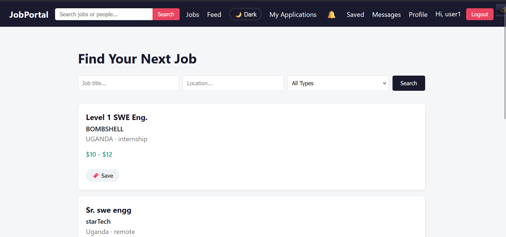
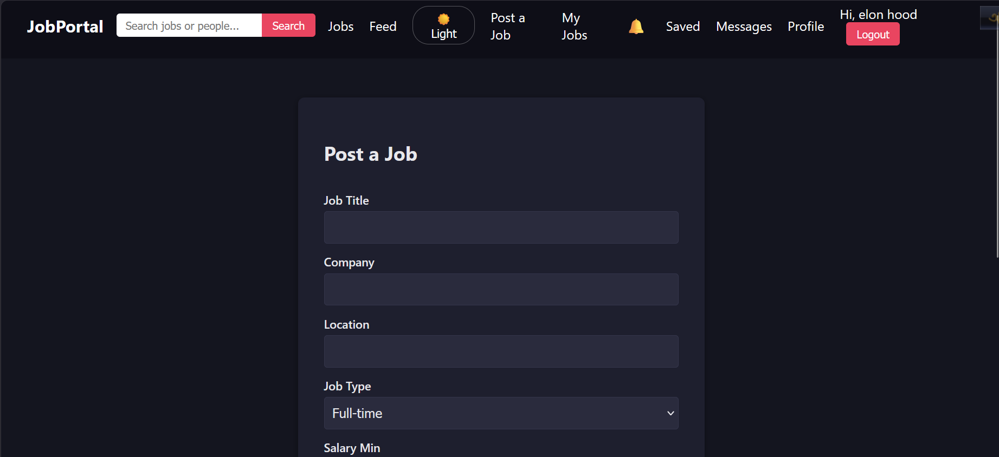
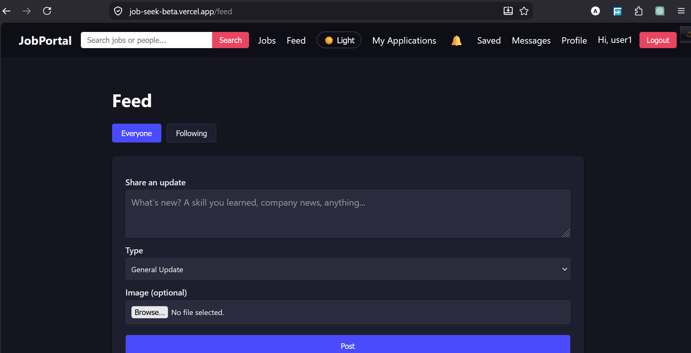
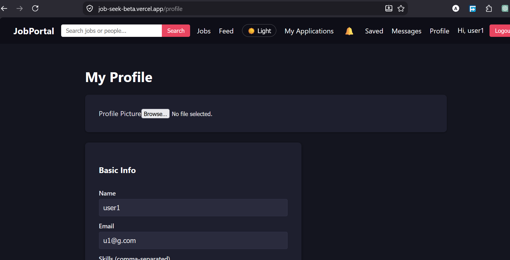
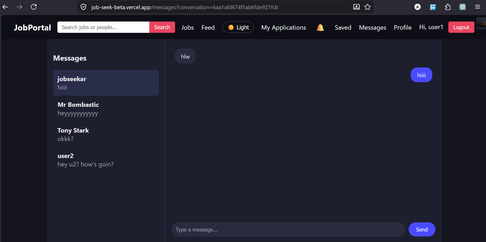
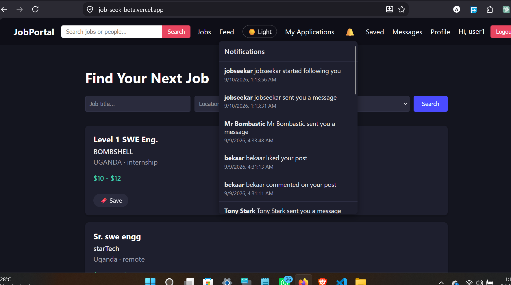
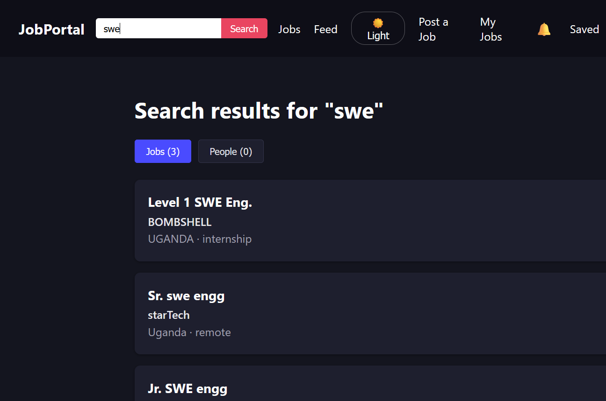
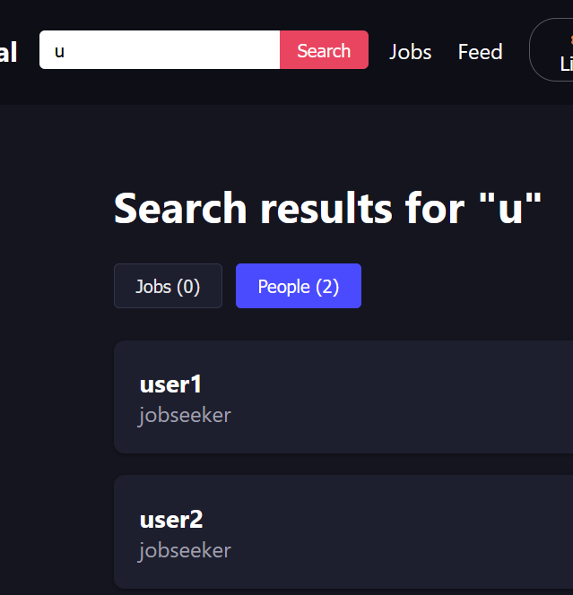

# JobSeek — Full-Stack Job Portal & Professional Network

A full-stack job portal built with the MERN stack, combining traditional job search functionality with LinkedIn-style social networking features. Job seekers can find and apply to jobs, employers can post openings and manage applicants, and everyone can connect, post updates, and message each other — all in one platform.

🔗 **Live Demo:** [https://job-seek-beta.vercel.app](https://job-seek-beta.vercel.app)
💻 **Backend API:** [https://jobseek-9qnl.onrender.com](https://jobseek-9qnl.onrender.com)

---

## 📋 Table of Contents

- [Features](#-features)
- [Screenshots](#-screenshots)
- [Tech Stack](#-tech-stack)
- [Project Structure](#-project-structure)
- [Getting Started](#-getting-started)
- [Environment Variables](#-environment-variables)
- [API Overview](#-api-overview)
- [Roadmap](#-roadmap)
- [Contact](#-contact)

---

## ✨ Features

### Authentication & Roles
- JWT-based authentication with three roles: **Job Seeker**, **Employer**, and **Admin**
- Secure password hashing with bcrypt
- Role-based route protection on both frontend and backend

### Job Board
- Employers can post, edit, and delete job listings
- Job seekers can search and filter jobs by keyword, location, and job type
- Apply to jobs with resume upload (stored via Cloudinary)
- Track application status (pending, reviewed, shortlisted, rejected, accepted)

### Social Feed
- Share updates, new skills learned, or company news
- Like and comment on posts
- Personalized "Following" feed vs. global feed
- Image uploads on posts

### Networking
- Follow/unfollow other users
- View public profiles with post history and follower counts
- Global search across both jobs and people

### Messaging
- Direct one-on-one conversations between job seekers and employers
- Persistent conversation history
- Unread message tracking

### Notifications
- Real-time-style notifications for follows, likes, comments, and messages
- Unread count badge
- Mark individual or all notifications as read

### Saved Items
- Bookmark jobs and posts to revisit later
- Dedicated "Saved" section

### Admin Dashboard
- Platform-wide statistics (users, jobs, applications)
- User management (block/unblock accounts)
- Job moderation (remove any listing)

### UX
- Fully responsive design
- Dark mode with persistent theme preference
- Profile customization (profile picture, resume, company logo via Cloudinary)

---

## 📸 Screenshots

> Add your screenshots to a folder (e.g. `/screenshots`) in the repo root and update the paths below.

| Home / Job Search | Job Details |
|---|---|
|  |  ||  |

| Feed | User Profile |
|---|---|
|  |  |

| Messages | Notifications |
|---|---|
|  |  |

| Search|
|---|---|
|  |  |


---

## 🛠 Tech Stack

**Frontend**
- React (Vite)
- React Router
- Axios
- Plain CSS with CSS variables (theme support)

**Backend**
- Node.js + Express
- MongoDB with Mongoose
- JWT for authentication
- Multer + Cloudinary for file uploads
- bcrypt.js for password hashing

**Deployment**
- Frontend: Vercel
- Backend: Render
- Database: MongoDB Atlas
- File storage: Cloudinary

---

## 📁 Project Structure

```
job-portal/
├── backend/
│   ├── config/          # DB + Cloudinary configuration
│   ├── controllers/      # Route handler logic
│   ├── middleware/        # Auth, role checks, file upload
│   ├── models/            # Mongoose schemas
│   ├── routes/             # Express routes
│   ├── utils/               # Helper functions (JWT signing, etc.)
│   └── server.js
│
└── frontend/
    ├── src/
    │   ├── api/           # Axios instance
    │   ├── components/     # Reusable UI components
    │   ├── context/         # Auth & Theme context providers
    │   ├── pages/            # Route-level page components
    │   ├── App.jsx
    │   └── main.jsx
```

---

## 🚀 Getting Started

### Prerequisites
- Node.js (v18+)
- MongoDB Atlas account
- Cloudinary account

### 1. Clone the repository
```bash
git clone https://github.com/Hossain-Altaf/JobSeek-A-Job-Searching-Platform.git
cd JobSeek-A-Job-Searching-Platform
```

### 2. Backend setup
```bash
cd backend
npm install
```

Create a `.env` file in `backend/` (see [Environment Variables](#-environment-variables)).

```bash
npm run dev
```

### 3. Frontend setup
```bash
cd ../frontend
npm install
```

Create a `.env` file in `frontend/`:
```
VITE_API_URL=http://localhost:5000/api
```

```bash
npm run dev
```

The app should now be running at `http://localhost:5173`, connected to the backend at `http://localhost:5000`.

---

## 🔑 Environment Variables

**`backend/.env`**
```
PORT=5000
MONGO_URI=your_mongodb_connection_string
JWT_SECRET=your_jwt_secret
CLOUDINARY_CLOUD_NAME=your_cloud_name
CLOUDINARY_API_KEY=your_api_key
CLOUDINARY_API_SECRET=your_api_secret
CLIENT_URL=http://localhost:5173
```

**`frontend/.env`**
```
VITE_API_URL=http://localhost:5000/api
```

---

## 🔌 API Overview

| Resource | Base Route | Description |
|---|---|---|
| Auth | `/api/auth` | Register, login, get current user |
| Users | `/api/users` | Profile management, search, public profiles |
| Jobs | `/api/jobs` | Job CRUD, search/filter |
| Applications | `/api/applications` | Apply to jobs, manage applicant status |
| Posts | `/api/posts` | Feed posts, likes, comments |
| Follow | `/api/follow` | Follow/unfollow, followers/following lists |
| Notifications | `/api/notifications` | Notification feed, read status |
| Messages | `/api/messages` | Conversations and messaging |
| Saved | `/api/saved` | Saved jobs and posts |
| Admin | `/api/admin` | Stats, user moderation, job moderation |

All protected routes require a `Authorization: Bearer <token>` header.

---

## 🗺 Roadmap

- [ ] Real-time messaging and notifications via Socket.io
- [ ] Pagination on job listings
- [ ] Input validation with express-validator
- [ ] Email notifications
- [ ] Advanced job matching based on skills

---

## 📬 Contact

**Altaf Hossain**
Feel free to reach out with feedback or questions.

- LinkedIn: [[your LinkedIn URL](https://www.linkedin.com/in/altaf-hossain13/)]
- GitHub: [@Hossain-Altaf](https://github.com/Hossain-Altaf)
- Email: altaf.swe13@gmail.com

---

⭐ If you found this project interesting, consider giving it a star on GitHub!